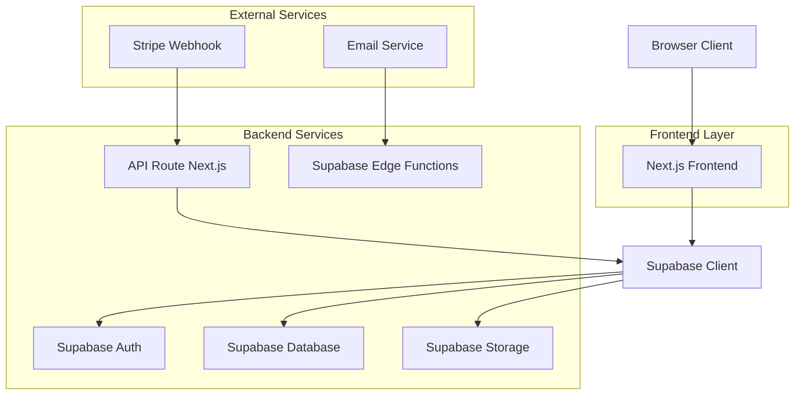
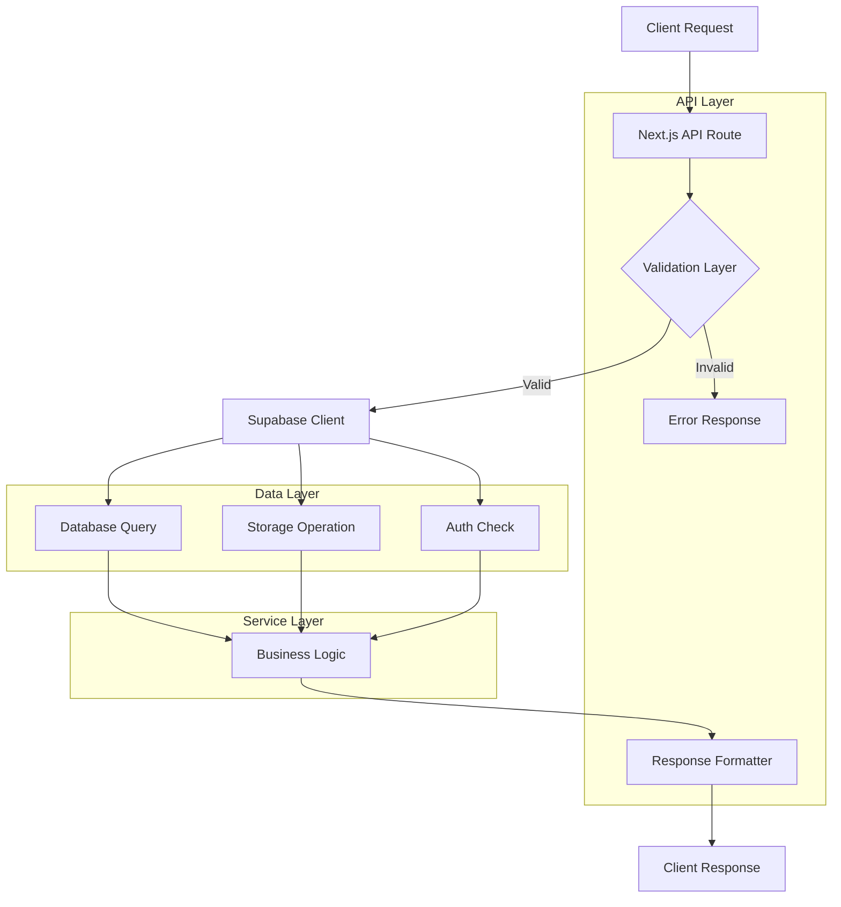
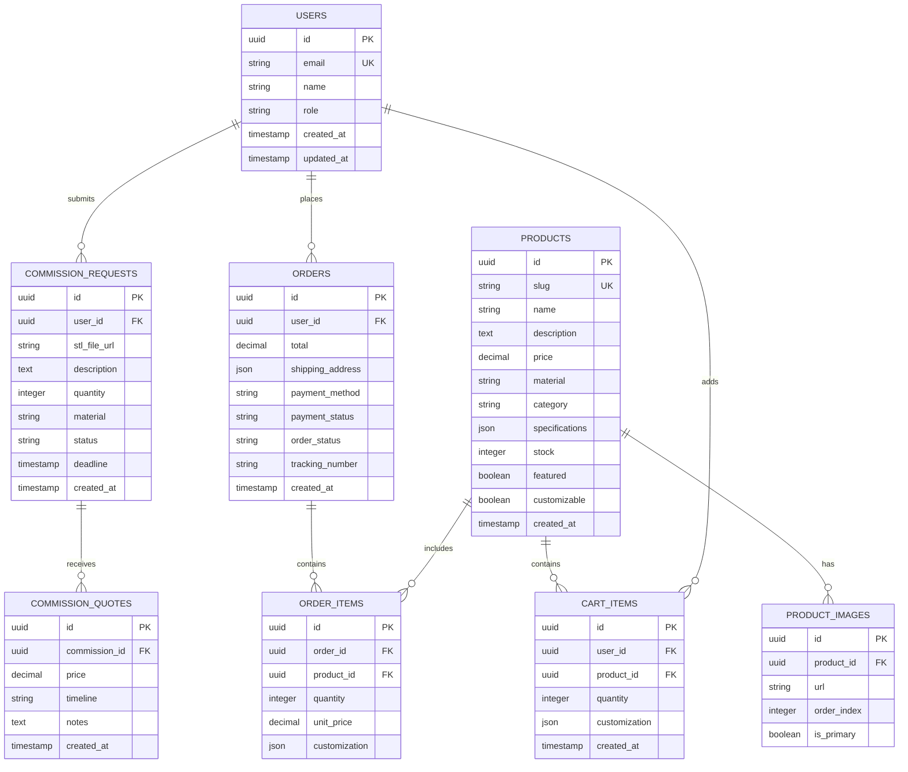

## 1. Architettura Sistema



## 2. Stack Tecnologico

* **Frontend**: Next.js 14 + React 18 + TypeScript 5

* **Styling**: Tailwind CSS 3 + Framer Motion (animazioni)

* **Stato Globale**: Zustand (carrello, UI state)

* **Backend**: Supabase (PostgreSQL, Auth, Storage, Real-time)

* **Pagamenti**: Stripe SDK + PayPal SDK

* **Upload 3D**: Three.js (preview STL), react-three-fiber

* **Email**: Supabase Edge Functions + Resend

* **Deployment**: Vercel (frontend) + Supabase (backend)

* **Initialization Tool**: create-next-app

## 3. Definizione Rotte

| Route                         | Tipo      | Descrizione                               |
| ----------------------------- | --------- | ----------------------------------------- |
| `/`                           | Page      | Homepage con hero section e categorie     |
| `/shop`                       | Page      | Griglia prodotti con filtri e paginazione |
| `/shop/[slug]`                | Dynamic   | Pagina dettaglio prodotto con galleria    |
| `/commissioni`                | Page      | Landing servizi su commissione            |
| `/commissioni/richiesta`      | Page      | Form upload STL e preventivo              |
| `/chi-siamo`                  | Page      | Brand story e processo produttivo         |
| `/contatti`                   | Page      | Form contatti e informazioni              |
| `/carrello`                   | Page      | Riepilogo carrello e checkout             |
| `/account`                    | Protected | Area personale utente registrato          |
| `/account/ordini`             | Protected | Storico ordini e tracking                 |
| `/account/commissioni`        | Protected | Stato richieste preventivo                |
| `/api/auth/callback`          | API       | Gestione auth Supabase                    |
| `/api/webhook/stripe`         | API       | Webhook pagamenti Stripe                  |
| `/api/commissioni/upload`     | API       | Upload file STL con validazione           |
| `/api/commissioni/preventivo` | API       | Generazione preventivo automatico         |

## 4. Definizioni API

### 4.1 Autenticazione Supabase

```typescript
// Tipi condivisi
interface User {
  id: string
  email: string
  name: string
  role: 'customer' | 'admin'
  created_at: string
}

interface AuthResponse {
  user: User | null
  session: Session | null
  error: AuthError | null
}

// Login
POST /api/auth/login
Body: { email: string, password: string }
Response: AuthResponse

// Registrazione
POST /api/auth/register  
Body: { email: string, password: string, name: string }
Response: AuthResponse
```

### 4.2 Prodotti

```typescript
interface Product {
  id: string
  slug: string
  name: string
  description: string
  price: number
  material: 'pla' | 'resina'
  category: string
  images: string[]
  specifications: {
    dimensions: string
    weight: string
    colors: string[]
    customizable: boolean
  }
  stock: number
  featured: boolean
  created_at: string
}

// Lista prodotti con filtri
GET /api/products?material=pla&minPrice=10&maxPrice=100&category=vase&page=1
Response: {
  products: Product[]
  total: number
  pages: number
  currentPage: number
}

// Dettaglio prodotto
GET /api/products/[slug]
Response: { product: Product }
```

### 4.3 Carrello e Ordini

```typescript
interface CartItem {
  productId: string
  quantity: number
  customization?: {
    color?: string
    size?: string
    engraving?: string
  }
}

interface Order {
  id: string
  userId: string
  items: CartItem[]
  total: number
  shipping: {
    name: string
    address: string
    city: string
    zipCode: string
    country: string
  }
  paymentMethod: 'stripe' | 'paypal'
  paymentStatus: 'pending' | 'completed' | 'failed'
  orderStatus: 'processing' | 'shipped' | 'delivered' | 'cancelled'
  trackingNumber?: string
  created_at: string
}

// Crea ordine
POST /api/orders/create
Body: { items: CartItem[], shipping: ShippingInfo, paymentMethod: string }
Response: { order: Order, clientSecret?: string }
```

### 4.4 Commissioni STL

```typescript
interface CommissionRequest {
  id: string
  userId: string
  stlFile: string // URL file in Supabase Storage
  projectDescription: string
  quantity: number
  material: 'pla' | 'resina' | 'both'
  preferredColor?: string
  deadline?: string
  budget?: number
  status: 'pending' | 'quoted' | 'approved' | 'in_progress' | 'completed' | 'rejected'
  quote?: {
    price: number
    timeline: string
    notes: string
  }
  created_at: string
}

// Upload file STL
POST /api/commissioni/upload
Content-Type: multipart/form-data
Body: FormData con file .stl/.obj (max 50MB)
Response: { url: string, filename: string, size: number }

// Richiedi preventivo
POST /api/commissioni/richiesta
Body: Omit<CommissionRequest, 'id' | 'userId' | 'status' | 'created_at'>
Response: { commission: CommissionRequest }
```

## 5. Architettura Server-Side



## 6. Modello Dati

### 6.1 Schema Database



### 6.2 Definizione Tabelle Supabase

```sql
-- Tabella Utenti (gestita da Supabase Auth)
-- Dati aggiuntivi in tabella profiles
CREATE TABLE profiles (
    id UUID REFERENCES auth.users(id) PRIMARY KEY,
    name TEXT NOT NULL,
    role TEXT DEFAULT 'customer' CHECK (role IN ('customer', 'admin')),
    phone TEXT,
    created_at TIMESTAMP WITH TIME ZONE DEFAULT NOW(),
    updated_at TIMESTAMP WITH TIME ZONE DEFAULT NOW()
);

-- Tabella Prodotti
CREATE TABLE products (
    id UUID PRIMARY KEY DEFAULT gen_random_uuid(),
    slug TEXT UNIQUE NOT NULL,
    name TEXT NOT NULL,
    description TEXT NOT NULL,
    price DECIMAL(10,2) NOT NULL CHECK (price > 0),
    material TEXT CHECK (material IN ('pla', 'resina')),
    category TEXT NOT NULL,
    specifications JSONB DEFAULT '{}',
    stock INTEGER DEFAULT 0 CHECK (stock >= 0),
    featured BOOLEAN DEFAULT FALSE,
    customizable BOOLEAN DEFAULT FALSE,
    created_at TIMESTAMP WITH TIME ZONE DEFAULT NOW(),
    updated_at TIMESTAMP WITH TIME ZONE DEFAULT NOW()
);

-- Tabella Immagini Prodotto
CREATE TABLE product_images (
    id UUID PRIMARY KEY DEFAULT gen_random_uuid(),
    product_id UUID REFERENCES products(id) ON DELETE CASCADE,
    url TEXT NOT NULL,
    order_index INTEGER DEFAULT 0,
    is_primary BOOLEAN DEFAULT FALSE,
    created_at TIMESTAMP WITH TIME ZONE DEFAULT NOW()
);

-- Tabella Carrello
CREATE TABLE cart_items (
    id UUID PRIMARY KEY DEFAULT gen_random_uuid(),
    user_id UUID REFERENCES auth.users(id) ON DELETE CASCADE,
    product_id UUID REFERENCES products(id) ON DELETE CASCADE,
    quantity INTEGER NOT NULL CHECK (quantity > 0),
    customization JSONB DEFAULT '{}',
    created_at TIMESTAMP WITH TIME ZONE DEFAULT NOW(),
    UNIQUE(user_id, product_id)
);

-- Tabella Ordini
CREATE TABLE orders (
    id UUID PRIMARY KEY DEFAULT gen_random_uuid(),
    user_id UUID REFERENCES auth.users(id) ON DELETE CASCADE,
    total DECIMAL(10,2) NOT NULL CHECK (total > 0),
    shipping_address JSONB NOT NULL,
    payment_method TEXT CHECK (payment_method IN ('stripe', 'paypal')),
    payment_status TEXT DEFAULT 'pending' CHECK (payment_status IN ('pending', 'completed', 'failed')),
    order_status TEXT DEFAULT 'processing' CHECK (order_status IN ('processing', 'shipped', 'delivered', 'cancelled')),
    tracking_number TEXT,
    created_at TIMESTAMP WITH TIME ZONE DEFAULT NOW(),
    updated_at TIMESTAMP WITH TIME ZONE DEFAULT NOW()
);

-- Tabella Items Ordine
CREATE TABLE order_items (
    id UUID PRIMARY KEY DEFAULT gen_random_uuid(),
    order_id UUID REFERENCES orders(id) ON DELETE CASCADE,
    product_id UUID REFERENCES products(id) ON DELETE CASCADE,
    quantity INTEGER NOT NULL CHECK (quantity > 0),
    unit_price DECIMAL(10,2) NOT NULL CHECK (unit_price > 0),
    customization JSONB DEFAULT '{}',
    created_at TIMESTAMP WITH TIME ZONE DEFAULT NOW()
);

-- Tabella Richieste Commissione
CREATE TABLE commission_requests (
    id UUID PRIMARY KEY DEFAULT gen_random_uuid(),
    user_id UUID REFERENCES auth.users(id) ON DELETE CASCADE,
    stl_file_url TEXT NOT NULL,
    project_description TEXT NOT NULL,
    quantity INTEGER NOT NULL CHECK (quantity > 0),
    material TEXT CHECK (material IN ('pla', 'resina', 'both')),
    status TEXT DEFAULT 'pending' CHECK (status IN ('pending', 'quoted', 'approved', 'in_progress', 'completed', 'rejected')),
    deadline TIMESTAMP WITH TIME ZONE,
    budget DECIMAL(10,2),
    created_at TIMESTAMP WITH TIME ZONE DEFAULT NOW(),
    updated_at TIMESTAMP WITH TIME ZONE DEFAULT NOW()
);

-- Tabella Preventivi Commissione
CREATE TABLE commission_quotes (
    id UUID PRIMARY KEY DEFAULT gen_random_uuid(),
    commission_id UUID REFERENCES commission_requests(id) ON DELETE CASCADE,
    price DECIMAL(10,2) NOT NULL CHECK (price > 0),
    timeline TEXT NOT NULL,
    notes TEXT,
    created_at TIMESTAMP WITH TIME ZONE DEFAULT NOW()
);

-- Indici per performance
CREATE INDEX idx_products_material ON products(material);
CREATE INDEX idx_products_category ON products(category);
CREATE INDEX idx_products_featured ON products(featured);
CREATE INDEX idx_products_price ON products(price);
CREATE INDEX idx_cart_items_user_id ON cart_items(user_id);
CREATE INDEX idx_orders_user_id ON orders(user_id);
CREATE INDEX idx_orders_status ON orders(order_status);
CREATE INDEX idx_commission_requests_user_id ON commission_requests(user_id);
CREATE INDEX idx_commission_requests_status ON commission_requests(status);

-- Politiche RLS (Row Level Security)
-- Prodotti: visibili a tutti
ALTER TABLE products ENABLE ROW LEVEL SECURITY;
CREATE POLICY "Prodotti visibili a tutti" ON products FOR SELECT USING (true);

-- Solo admin possono modificare prodotti
CREATE POLICY "Solo admin possono modificare prodotti" ON products 
FOR ALL USING (
    EXISTS (
        SELECT 1 FROM profiles 
        WHERE profiles.id = auth.uid() 
        AND profiles.role = 'admin'
    )
);

-- Carrello: utenti possono gestire solo i propri items
ALTER TABLE cart_items ENABLE ROW LEVEL SECURITY;
CREATE POLICY "Utenti possono vedere propri carrello" ON cart_items 
FOR SELECT USING (user_id = auth.uid());

CREATE POLICY "Utenti possono modificare propri carrello" ON cart_items 
FOR ALL USING (user_id = auth.uid());

-- Ordini: utenti possono vedere solo propri ordini
ALTER TABLE orders ENABLE ROW LEVEL SECURITY;
CREATE POLICY "Utenti possono vedere propri ordini" ON orders 
FOR SELECT USING (user_id = auth.uid());

-- Commissioni: utenti possono gestire solo proprie richieste
ALTER TABLE commission_requests ENABLE ROW LEVEL SECURITY;
CREATE POLICY "Utenti possono vedere proprie commissioni" ON commission_requests 
FOR SELECT USING (user_id = auth.uid());

CREATE POLICY "Utenti possono creare commissioni" ON commission_requests 
FOR INSERT WITH CHECK (user_id = auth.uid());

-- Admin possono vedere tutto
CREATE POLICY "Admin possono vedere tutte le commissioni" ON commission_requests 
FOR SELECT USING (
    EXISTS (
        SELECT 1 FROM profiles 
        WHERE profiles.id = auth.uid() 
        AND profiles.role = 'admin'
    )
);
```

## 7. Sicurezza e Best Practices

### Validazione e Sanitizzazione

* Input validation su tutti i form client e server-side

* File upload: whitelist estensioni (.stl, .obj), max 50MB, scan antivirus

* Rate limiting: 100 richieste/minuto per IP, 5 tentativi login

* SQL injection prevention tramite Supabase prepared statements

### Autenticazione e Autorizzazione

* JWT tokens con Supabase Auth, refresh automatico

* Role-based access control (RBAC) con RLS policies

* Session management con secure httpOnly cookies

* Password policy: min 8 chars, uppercase, lowercase, number, special char

### Protezione Dati

* Encryption at rest per dati sensibili

* HTTPS enforcement con HSTS

* CORS configurato per dominio specifico

* DDoS protection tramite Cloudflare/Vercel

### Payment Security

* PCI DSS compliance tramite Stripe/PayPal

* Nessuna memorizzazione dati carta di credito

* 3D Secure 2.0 per autenticazione aggiuntiva

* Webhook validation con firma digitale

## 8. Performance Optimization

### Frontend Optimization

* Image optimization: Next.js Image component con automatic resizing

* Code splitting: Route-based e component-based lazy loading

* Bundle analysis: webpack-bundle-analyzer per size monitoring

* Prefetching: Link prefetch per navigazione immediata

### Database Optimization

* Query optimization con EXPLAIN ANALYZE

* Indici su colonne frequentemente queryate

* Connection pooling tramite Supabase

* Cache strategico per dati statici

### CDN e Caching

* Static assets su CDN globale

* Cache headers configurati per immagini e static files

* Service worker per offline functionality

* Redis cache per sessioni e dati temporanei (opzionale)

## 9. Monitoring e Analytics

### Application Monitoring

* Error tracking con Sentry integration

* Performance monitoring con Vercel Analytics

* Uptime monitoring con status page

* Log aggregation per debugging

### Business Analytics

* E-commerce tracking con Google Analytics 4

* Conversion funnel analysis

* Product performance metrics

* Customer behavior analytics

### Health Checks

* Database connection monitoring

* API endpoint health checks

* Payment gateway status monitoring

* File storage availability checks

