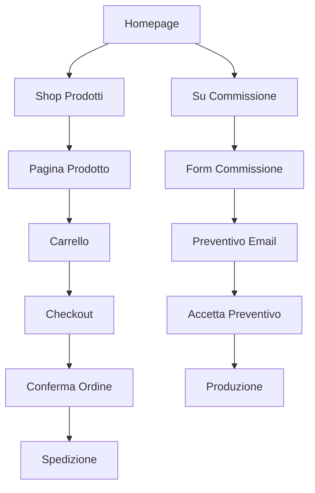

## 1. Panoramica del Prodotto

Sito e-commerce specializzato nella vendita di prodotti stampati in 3D e servizi di stampa su commissione. Il sito offre prodotti in PLA (bioplastica ecologica) e resina ad alta definizione, con possibilità di richiedere prototipi personalizzati e modifiche su file STL forniti dai clienti.

Il prodotto serve artigiani, designer, hobbisti e aziende che cercano soluzioni di stampa 3D di qualità. Trasmette innovazione tecnologica e artigianalità italiana, con focus sulla sostenibilità e personalizzazione.

## 2. Funzionalità Principali

### 2.1 Ruoli Utente

| Ruolo | Metodo di Registrazione | Permessi Principali |
|-------|------------------------|---------------------|
| Utente Ospite | Nessuna registrazione | Navigazione prodotti, richiesta preventivi |
| Cliente Registrato | Email o social login | Acquisto prodotti, gestione ordini, upload file STL |
| Admin | Registrazione manuale | Gestione prodotti, ordini, preventivi, contenuti sito |

### 2.2 Moduli Funzionali

Il sito e-commerce di stampa 3D comprende le seguenti pagine principali:

1. **Homepage**: Hero section con render 3D, presentazione brand, categorie prodotti, call-to-action principali
2. **Shop/Prodotti**: Griglia prodotti con filtri per materiale e prezzo, paginazione
3. **Pagina Prodotto**: Galleria immagini, specifiche tecniche, opzioni personalizzazione, recensioni
4. **Su Commissione**: Form richiesta preventivo con upload file STL, descrizione processo
5. **Chi Siamo**: Storia del brand, processo produttivo, gallery laboratorio
6. **Contatti**: Form contatto, informazioni, WhatsApp, social media
7. **Carrello**: Riepilogo prodotti, checkout, pagamento
8. **Area Cliente**: Storico ordini, stato commissioni, dati personali

### 2.3 Dettaglio Pagine

| Nome Pagina | Modulo | Descrizione Funzionalità |
|-------------|--------|--------------------------|
| Homepage | Hero Section | Render 3D interattivo o video, headline impattante, descrizione brand in 2 righe |
| Homepage | CTA Principali | Pulsanti "Scopri i prodotti" e "Richiedi preventivo" con scroll smooth |
| Homepage | Categorie | Cards con immagini per PLA, Resina, Personalizzati, Su Commissione |
| Homepage | Perché Sceglierci | 3-4 cards con icone (qualità, sostenibilità, personalizzazione, tempi rapidi) |
| Shop | Griglia Prodotti | Layout responsive 3-4 colonne desktop, 1 colonna mobile, lazy loading immagini |
| Shop | Filtri | Sidebar con filtri: materiale (PLA/Resina), fascia prezzo, disponibilità, categoria |
| Shop | Card Prodotto | Immagine hover zoom, nome, prezzo, materiale, badge "eco-friendly" per PLA |
| Pagina Prodotto | Galleria | Carousel immagini con zoom, video 360° se disponibile, thumbnail navigazione |
| Pagina Prodotto | Info Prodotto | Titolo, prezzo, descrizione breve, specifiche tecniche tabellari |
| Pagina Prodotto | Personalizzazione | Selettore colore, dimensioni, checkbox per incisioni personalizzate |
| Pagina Prodotto | CTA | Pulsante "Aggiungi al carrello" con animazione conferma, wishlist |
| Commissione | Processo | 4 steps visuali: Richiesta → Preventivo → Progettazione → Consegna |
| Commissione | Form Upload | Drag&drop file STL/OBJ, max 50MB, preview 3D del modello caricato |
| Commissione | Dettagli Richiesta | Campi: descrizione progetto, quantità, materiale preferito, deadline |
| Commissione | Preventivo | Invio email automatica al cliente con riepilogo e tempi stimati |
| Chi Siamo | Brand Story | Timeline visuale fondazione, mission, valori con immagini emozionali |
| Chi Siamo | Processo | Infografica processo stampa 3D: design → slicing → stampa → finitura |
| Chi Siamo | Laboratorio | Gallery foto stampanti 3D, processo lavorativo, tecnologie utilizzate |
| Contatti | Form | Campi: nome, email, telefono, oggetto, messaggio con validazione realtime |
| Contatti | Info | Indirizzo, email, telefono WhatsApp click-to-chat, orari lavorativi |
| Carrello | Riepilogo | Tabella prodotti con immagini miniatura, modifica quantità, rimozione |
| Carrello | Checkout | Form dati spedizione, selezione corriere, calcolo spese di spedizione |
| Carrello | Pagamento | Integrazione Stripe e PayPal, form sicuro con 3D Secure |
| Area Cliente | Dashboard | Cards con numero ordini, commissioni attive, ultimi acquisti |
| Area Cliente | Storico Ordini | Tabella con stato ordine, tracking spedizione, fatture scaricabili |
| Area Cliente | Commissioni | Lista richieste preventivo con stato (in attesa/approvata/in lavorazione) |

## 3. Flussi Principali

### Flusso Utente Standard
1. Utente atterra in Homepage → visiona hero e categorie
2. Naviga nello Shop → applica filtri → seleziona prodotto
3. In Pagina Prodotto → personalizza → aggiunge al carrello
4. Procede al Checkout → inserisce dati → paga con Stripe/PayPal
5. Riceve email conferma con dettagli ordine e tracking

### Flusso Commissione Personalizzata
1. Utente naviga in "Su Commissione" → legge processo
2. Upload file STL → sistema mostra preview e dimensioni
3. Compila form dettagli → specifica materiale e quantità
4. Invia richiesta → riceve email con preventivo e tempi
5. Accetta preventivo → avvia produzione con aggiornamenti stato

### Flusso Admin
1. Login area amministrativa → dashboard con metriche vendite
2. Gestione Prodotti: aggiungi/modifica/elimina, gestione immagini
3. Gestione Ordini: aggiorna stato, genera etichette spedizione
4. Gestione Commissioni: valuta STL, calcola preventivo, comunica con cliente

## 4. Design dell'Interfaccia

### 4.1 Stile Grafico
- **Colori Principali**: Nero (#000000), Grigio Scuro (#1a1a1a), Grigio Medio (#333333)
- **Colori Accentati**: Blu Neon (#00d4ff), Verde Neon (#00ff88), Azzurro Elettrico (#0080ff)
- **Typography**: Font sans-serif moderni (Inter, Roboto, Poppins)
- **Titoli**: 48-64px bold, testo bianco su sfondo scuro
- **Corpo Testo**: 16-18px, grigio chiaro (#cccccc) per contrasto ottimale
- **Buttons**: Stile 3D con gradient e ombra, hover effects con neon glow
- **Cards**: Bordi arrotondati 12px, sfumo gradient scuri, effetti hover levitazione
- **Icone**: Stile linea sottile con accenti neon, animazioni al hover
- **Layout**: Grid-based con card-based design, spaziatura generosa

### 4.2 Elementi UI Specifici

| Pagina | Elemento | Specifiche UI |
|--------|----------|---------------|
| Homepage | Hero 3D | Render Three.js o video loop 10s, overlay testo con animazione typewriter |
| Homepage | CTA Buttons | 200x60px, gradient blu-neon, border-radius 30px, glow effect hover |
| Shop | Filter Sidebar | 280px width, accordion per categorie, checkbox custom con stile neon |
| Shop | Product Grid | Gap 24px, card 280x380px, immagine 16:9, hover scale 1.05 |
| Prodotto | Image Gallery | Thumbnail 80x80px, main image 600x600px, zoom 2x on hover |
| Prodotto | Custom Options | Radio buttons per colore, dropdown per dimensioni, toggle switch per extra |
| Commissione | Upload Area | Drag&drop zone 400x200px, border dashed 2px, icona 3D animata |
| Commissione | Form | Input fields con border-bottom 2px, focus color neon, validazione realtime |
| Carrello | Product Row | 100px thumb, titolo bold, prezzo a destra, quantità stepper |
| Checkout | Payment | Stripe Elements custom style, radio buttons per metodo, security badges |

### 4.3 Responsive Design
- **Mobile-First Approach**: Design partito da 375px, scaling progressivo
- **Breakpoints**: 640px (sm), 768px (md), 1024px (lg), 1280px (xl)
- **Menu Mobile**: Hamburger con slide-in drawer, icone grandi 24px
- **Touch Optimization**: Pulsanti minimo 44x44px, swipe per gallery immagini
- **Performance**: Immagini responsive con srcset, lazy loading prioritizzato

### 4.4 Animazioni e Micro-interazioni
- **Scroll Animations**: Fade-in per sections, parallax per hero images
- **Button Hover**: Scale 1.02, box-shadow neon, transition 0.3s ease
- **Loading States**: Skeleton screens per contenuti, spinner 3D custom
- **Success States**: Checkmark animato con particelle, colori verdi neon
- **Error States**: Shake animation per form, messaggi con icona warning

## 5. Requisiti Tecnici

### Performance
- **Page Load**: <3s su 3G, <1.5s su 4G, punteggio Lighthouse >90
- **Image Optimization**: WebP con fallback JPEG, compressione 80%, lazy loading
- **Code Splitting**: Route-based splitting, component lazy loading per pagine interne
- **Caching**: Service worker per offline, cache-first strategy per immagini

### SEO e Accessibilità
- **Meta Tags**: Title, description custom per ogni pagina, Open Graph completo
- **Structured Data**: Product, Organization, Breadcrumb schema markup JSON-LD
- **URL Structure**: Semantica e pulita, hyphen separator, lowercase
- **Alt Text**: Descrizioni dettagliate per tutte le immagini, focus keywords
- **ARIA Labels**: Complete per screen readers, focus management per SPA
- **Color Contrast**: WCAG AAA compliance, ratio minimo 7:1 per testo normale

### Sicurezza
- **HTTPS**: Certificato SSL obbligatorio, HSTS header, redirect da HTTP
- **Form Validation**: Client e server-side, sanitizzazione input, CSRF protection
- **File Upload**: Scan antivirus, limite dimensione, whitelist estensioni
- **Payment Security**: PCI DSS compliance, tokenizzazione dati, 3D Secure 2.0
- **Privacy**: GDPR compliance, cookie banner, privacy policy, data encryption